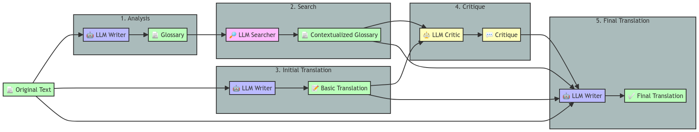

# 🌐💬 Aphra

<p align="center">
  <a href="https://github.com/DavidLMS/aphra/pulls">
    
  </a>
  <a href="LICENSE">
      
    </a>
    <a href="https://github.com/pylint-dev/pylint">
      
    </a>
</p>

🌐💬 Aphra is an open-source translation agent designed to enhance the quality of text translations by leveraging large language models (LLMs). Unlike traditional translation tools that rely solely on direct translations, Aphra introduces a multi-stage, context-aware process that includes glossary creation, contextual search, critique, and refinement. This approach aims to produce translations that not only retain the original meaning but also incorporate translator notes, contextual adjustments, and stylistic improvements. Whether you're translating blog posts, articles, or complex documents, Aphra ensures a more nuanced and accurate translation that respects the original content's integrity.

> **Important Note:** 🌐💬 Aphra is not intended to replace the work of a professional translator. Instead, it aims to facilitate multilingual support in small projects where hiring a professional translator may not be feasible. Aphra offers a practical solution for achieving quality translations in contexts where a fully professional translation service is out of scope, ensuring that language barriers do not hinder the global reach of your content.

<p align="center">
    <a href="https://huggingface.co/spaces/davidlms/aphra">Demo</a>
    ·
    <a href="https://github.com/DavidLMS/aphra/issues/new?assignees=&labels=bug&projects=&template=bug_report.md&title=%5BBUG%5D">Report Bug</a>
    ·
    <a href="https://github.com/DavidLMS/aphra/issues/new?assignees=&labels=enhancement&projects=&template=feature_request.md&title=%5BREQUEST%5D">Request Feature</a>
    ·
    <a href="https://github.com/DavidLMS/aphra/wiki">Wiki</a>
  </p>

## Table of Contents  
[Motivation](#motivation)  
[Why Aphra?](#why-aphra)

## Motivation

The spark for starting this project came from a desire to challenge myself by designing a complex agentic workflow from scratch. The primary goal here is to learn and grow through the process of building something like this from the ground up. I chose the theme of translation because I've been toying with the idea of publishing [my personal blog](https://davidlms.com) in English as well. My next step will be to integrate Aphra into the publication pipeline, so translations become a seamless part of the process.

As a computer science teacher, I also saw this as a great opportunity to create a small, yet complete, open-source project that follows best practices for publishing on GitHub. That's why there are so many options to get started, all designed with a didactic approach in mind. Any feedback on how to improve in that area is more than welcome.

## Why Aphra?

The name "Aphra" is a tribute to [Aphra Behn](https://en.wikipedia.org/wiki/Aphra_Behn), one of the first English women to earn a living through writing in the 17th century. Behn was a playwright, poet, and translator who broke through significant cultural barriers, making her an early pioneer for women in literature.

Naming this project after Aphra Behn is a way to honor her legacy of challenging the status quo and shaping the way we think about language and expression. Her influence reminds us of the importance of creating spaces where voices can be heard and ideas can flourish.

As [Virginia Woolf](https://en.wikipedia.org/wiki/Virginia_Woolf) famously said, "All women together, ought to let flowers fall upon the grave of Aphra Behn... for it was she who earned them the right to speak their minds" (Woolf, Virginia. A Room of One's Own. 1928, at 65).

## How 🌐💬 Aphra Works

🌐💬 Aphra employs a multi-stage, agentic approach to translation, designed to closely mimic the steps a human translator might take when working on a text. Here's how the process unfolds:



1. **Analysis**: The process begins with the "LLM Writer," a language model, analyzing the original text. During this analysis, the model identifies key expressions, terms, and entities that may pose challenges in translation, such as culturally specific references or industry jargon.
2. **Search**: Following the analysis, the "LLM Searcher," a model with internet access, takes the identified terms and searches for additional context. This context could include definitions, background information, or examples of usage in different contexts, ensuring that the translation is well-informed and accurate.
3. **Initial Translation**: Simultaneously with the search phase, another instance of the "LLM Writer" begins translating the original text without yet incorporating the contextual information gathered. This step focuses on producing a raw, direct translation that preserves the original style and structure of the text.
4. **Critique**: Once the initial translation is complete and the context has been gathered, the "LLM Critic" comes into play. This model reviews the initial translation in light of the context and original text, providing feedback on areas where the translation could be improved. The critique might highlight potential misinterpretations, suggest alternative phrasings, or recommend adding translator notes for clarity.
5. **Final Translation**: Finally, the "LLM Writer" revisits the translation, incorporating the critic's feedback and the contextual information gathered earlier. The result is a polished, contextually aware translation that is more nuanced and accurate than a simple literal translation, often including additional notes to guide the reader through complex or ambiguous parts of the text.

This structured approach enables 🌐💬 Aphra to produce translations that are not only linguistically accurate but also contextually rich, making it a valuable tool for small projects aiming to reach a global audience without the resources to hire a professional translator.

## Demo

You can test 🌐💬 Aphra here: [https://davidlms.github.io/aphra](https://davidlms.github.io/aphra).

## Getting Started

To get started with 🌐💬 Aphra, follow these steps:

### Prerequisites

Ensure you have the following installed on your system:
- `git` (for cloning the repository)
- Python 3.8 or higher
- `pip` (Python package installer)
- Docker (optional, for using Docker)

### Clone the Repository

Before proceeding with the configuration or installation, you need to clone the repository. This is a common step required for all installation methods.

1. Clone the repository:
    ```bash
    git clone https://github.com/DavidLMS/aphra.git
    ```

2. Navigate into the project directory:
    ```bash
    cd aphra
    ```

### Configuration

1. Copy the example configuration file:
    ```bash
    cp config.example.toml config.toml
    ```

2. Edit `config.toml` to add your [OpenRouter](https://openrouter.ai) API key and desired model names.

After configuring the `config.toml` file, you can either:

- **Use 🌐💬 Aphra directly in the current directory** of the repository (as explained in the [Usage section](#usage)), or
- **Proceed with the installation** in the next section to make 🌐💬 Aphra accessible from any script on your system.

> **Note:** If you choose to proceed with the installation, remember to move the `config.toml` file to the location of the script using 🌐💬 Aphra, or specify its path directly when calling the function.

### Installation

#### Option 1: Install Locally with `pip`

This option is the simplest way to install 🌐💬 Aphra if you don't need to isolate its dependencies from other projects. It directly installs the package on your system using `pip`, which is the standard package manager for Python.

1. Install the package locally:
    ```bash
    pip install .
    ```

#### Option 2: Install with Poetry

Poetry is a dependency management and packaging tool for Python that helps you manage your project's dependencies more effectively. It also simplifies the process of packaging your Python projects.

1. Install Poetry if you haven't already:
    ```bash
    curl -sSL https://install.python-poetry.org | python3 -
    ```

2. Install dependencies and the package:
    ```bash
    poetry install
    ```

3. Activate the virtual environment created by Poetry:
    ```bash
    poetry shell
    ```

#### Option 3: Use a Virtual Environment

A virtual environment is an isolated environment that allows you to install packages separately from your system's Python installation. This is particularly useful to avoid conflicts between packages required by different projects.

1. Create and activate a virtual environment:
    ```bash
    python -m venv aphra
    source aphra/bin/activate  # On Windows: aphra\Scripts\activate
    ```
    
2. Remove the file pyproject.toml:
    ```bash
    rm pyproject.toml
    ```
    
3. Install the package locally:
    ```bash
    pip install .
    ```

#### Option 4: Use Docker

Docker is a platform that allows you to package an application and its dependencies into a "container." This container can run consistently across different environments, making it ideal for ensuring that your project works the same way on any machine.

1. Build the Docker image:
    ```bash
    docker build -t aphra .
    ```
    > **Note:** If you encounter permission errors during the build, try running the command with `sudo`.

2. Ensure the entry script has execution permissions. Run the following command:
    ```bash
    chmod +x entrypoint.sh
    ```
    > **For Windows users:** You can add execute permissions using Git Bash or WSL (Windows Subsystem for Linux). If you’re using PowerShell or Command Prompt, you might not need to change permissions, but ensure the script is executable in your environment.

3. Understand the `docker run` command:
    - `-v $(pwd):/workspace`: This option mounts your current directory (`$(pwd)` in Unix-like systems, `%cd%` in Windows) to the `/workspace` directory inside the container. This allows the container to access files in your current directory.
    - `aphra`: This is the name of the Docker image you built in step 1.
    - `English Spanish`: These are the source and target languages for translation. Replace them with the languages you need.
    - `input.md`: This is the path to the input file on your host machine.
    - `output.md`: This is the path where the translated output will be saved on your host machine.

4. Run the Docker container:
    ```bash
    docker run -v $(pwd):/workspace aphra English Spanish input.md output.md
    ```

5. Display the translation by printing the content of the output file:
    - On Unix-like systems (Linux, macOS, WSL):
    ```bash
    cat output.md
    ```
    - On Windows (PowerShell):
    ```bash
    Get-Content output.md
    ```
    - On Windows (Command Prompt):
    ```cmd
    type output.md
    ```

### Usage

#### Basic Translation

The `translate` function allows you to translate text from one language to another using the configured language models. The function takes the following parameters:

- `source_language`: The language of the input text (e.g., "Spanish").
- `target_language`: The language you want to translate the text into (e.g., "English").
- `text`: The text you want to translate.
- `config_file`: The path to the configuration file containing API keys and model settings. Defaults to "config.toml".
- `log_calls`: A boolean indicating whether to log API calls for debugging purposes. Defaults to `False`.

Here is how you can use the `translate` function in a generic way:

```python
from aphra import translate

translation = translate(source_language='source_language',
                        target_language='target_language',
                        text='text_to_translate',
                        config_file='config.toml',
                        log_calls=False)
print(translation)
````

#### Examples

##### Example 1: Translating a Simple Sentence

Suppose you want to translate the sentence "Hola mundo" from Spanish to English. The code would look like this:

```python
from aphra import translate

translation = translate(source_language='Spanish',
                        target_language='English',
                        text='Hola mundo',
                        config_file='config.toml',
                        log_calls=False)
print(translation)
````

##### Example 2: Translating Content from a Markdown File

If you have a Markdown file (input.md) containing the text you want to translate, you can read the file, translate its content, and then print the result or save it to another file. Here's how:

```python
from aphra import translate

# Read the content from the Markdown file
with open('input.md', 'r', encoding='utf-8') as file:
    text_to_translate = file.read()

# Translate the content from Spanish to English
translation = translate(source_language='Spanish',
                        target_language='English',
                        text=text_to_translate,
                        config_file='config.toml',
                        log_calls=False)

# Print the translation or save it to a file
print(translation)

with open('output.md', 'w', encoding='utf-8') as output_file:
    output_file.write(translation)
```

In this example:

- We first read the text from input.md.
- Then, we translate the text from Spanish to English.
- Finally, we print the translation to the console and save it to output.md.

## Customizability and Ideas for Extensions

🌐💬 Aphra is designed with flexibility in mind, making it easy to tailor to your specific needs. The simplest way to customize Aphra is by maintaining the defined call flow and modifying the prompts within the `prompts` folder for each step. This approach allows you to adapt the output to your desired outcome for most use cases.

If you need to modify the flow itself, you'll need to dive into the code in `translate.py`. While this is a bit more complex, it's entirely doable for those looking to extend the functionality of 🌐💬 Aphra.

Here are some ideas for further extensions:

- **Agent-Based Web Search:** Transform the LLM Searcher step into an agent that can search the Internet, removing the reliance on an LLM with built-in Internet access.
- **Local Operation:** Once the above is implemented, consider adapting 🌐💬 Aphra to run locally using tools like [Ollama](https://ollama.com).
- **Alternative Flows:** Create alternative workflows for specific use cases, giving 🌐💬 Aphra even more versatility.
- **Modular Prompts:** Develop modular versions of 🌐💬 Aphra's prompts tailored to different use cases.
- **And Beyond:** The possibilities are as vast as your imagination. 🌐💬 Aphra is a starting point, and the directions you can take it are endless.

Feel free to experiment and extend 🌐💬 Aphra in ways that suit your projects and ideas.

## License

🌐💬 Aphra is released under the [MIT License](https://github.com/DavidLMS/aphra/blob/main/LICENSE). You are free to use, modify, and distribute the code for both commercial and non-commercial purposes.

## Contributing

Contributions to 🌐💬 Aphra are welcome! Whether it's improving the code, enhancing the documentation, or suggesting new features, your input is valuable. Please check out the [CONTRIBUTING.md](https://github.com/DavidLMS/aphra/blob/main/CONTRIBUTING.md) file for guidelines on how to get started and make your contributions count.

## References

- *Assisting in Writing Wikipedia-like Articles From Scratch with Large Language Models*, Shao et al. (2024), [https://arxiv.org/abs/2402.14207](https://arxiv.org/abs/2402.14207)
- *Translation Agent*, Ng (2024), [https://github.com/andrewyng/translation-agent](https://github.com/andrewyng/translation-agent)
