# 🌐💬 Aphra

<p align="center">
  <a href="https://github.com/DavidLMS/aphra/pulls">
    
  </a>
  <a href="LICENSE">
      
    </a>
    <a href="https://github.com/pylint-dev/pylint">
      
    </a>
</p>

🌐💬 Aphra is...

**Important note**:

## Motivation

## Why Aphra?

## How 🌐💬 Aphra Works

```mermaid
flowchart LR
    T[📄 Original Text]
    
    subgraph "1. Analysis"
        direction TB
        A[🤖 LLM Writer] -->C[📄 Glossary]
    end
    
    subgraph "2. Search"
        direction TB
        D[🔎 LLM Searcher] --> F[📄 Contextualized Glossary]
    end
    
    subgraph "3. Initial Translation"
        direction TB
        G[🤖 LLM Writer] -->H[📝 Basic Translation]
    end
    
    subgraph "4. Critique"
        direction TB
        I[⚖️ LLM Critic] --> J[💬 Critique]
    end
    
    subgraph "5. Final Translation"
        direction TB
        K[🤖 LLM Writer] --> L[✅ Final Translation]
    end

    T --> A
    T --> G
    C --> D
    F --> I
    H --> I
    T --> K
    H --> K
    F --> K
    J --> K
    
    classDef default fill:#abb,stroke:#333,stroke-width:2px;
    classDef robot fill:#bbf,stroke:#333,stroke-width:2px;
    classDef document fill:#bfb,stroke:#333,stroke-width:2px;
    classDef search fill:#fbf,stroke:#333,stroke-width:2px;
    classDef critic fill:#ffb,stroke:#333,stroke-width:2px;
    class A,G,K robot;
    class T,B,C,F,H,L document;
    class D search;
    class I,J critic;
```



## Demo

You can test the 🌐💬 Aphra here: [https://davidlms.github.io/aphra](https://davidlms.github.io/aphra).

## Getting Started

To get started with 🌐💬 Aphra, follow these steps:

### Prerequisites

Ensure you have the following installed on your system:
- Python 3.6 or higher
- `pip` (Python package installer)
- `git` (for cloning the repository)
- Docker (optional, for using Docker)
- Poetry (optional, for dependency management)

### Installation

#### Option 1: Install Locally with `pip`

1. Clone the repository:
    ```bash
    git clone https://github.com/DavidLMS/aphra.git
    cd aphra
    ```

2. Install the package locally:
    ```bash
    pip install .
    ```

#### Option 2: Use a Virtual Environment

1. Create and activate a virtual environment:
    ```bash
    python -m venv venv
    source venv/bin/activate  # On Windows: venv\Scripts\activate
    ```

2. Clone the repository:
    ```bash
    git clone https://github.com/DavidLMS/aphra.git
    cd aphra
    ```

3. Install the package locally:
    ```bash
    pip install .
    ```

#### Option 3: Install with Poetry

1. Install Poetry if you haven't already:
    ```bash
    curl -sSL https://install.python-poetry.org | python3 -
    ```

2. Clone the repository:
    ```bash
    git clone https://github.com/DavidLMS/aphra.git
    cd aphra
    ```

3. Install dependencies and the package:
    ```bash
    poetry install
    ```

#### Option 4: Use Docker

1. Clone the repository:
    ```bash
    git clone https://github.com/DavidLMS/aphra.git
    cd aphra
    ```

2. Build the Docker image:
    ```bash
    docker build -t aphra .
    ```

3. Create an input file (e.g., `input.md` with the text to translate):
    ```markdown
    Hola Mundo
    ```

4. Run the Docker container:
    ```bash
    docker run -v $(pwd):/app aphra English Spanish /app/input.md /app/output.md
    ```

5. Check the translation in the output file (e.g., `output.md`):
    ```markdown
    Hello World
    ```

### Configuration

1. Copy the example configuration file:
    ```bash
    cp config.example.toml config.toml
    ```

2. Edit `config.toml` to add your OpenRouter API key and desired model names.

### Usage

#### Basic Translation

```python
from aphra import translate

translation = translate('Spanish', 'English', 'Hola mundo', config_file='config.toml', log_calls=False)
print(translation)
```

## Customizability and ideas for extensions

## License

🌐💬 Aphra is released under the MIT License. You are free to use, modify, and distribute the code for both commercial and non-commercial purposes.

## References

- *Assisting in Writing Wikipedia-like Articles From Scratch with Large Language Models*, Shao et al. (2024), [https://arxiv.org/abs/2402.14207](https://arxiv.org/abs/2402.14207)
- *Translation Agent*, Ng (2024), [https://github.com/andrewyng/translation-agent](https://github.com/andrewyng/translation-agent)