# 🌐💬 Aphra

<p align="center">
  <a href="https://github.com/DavidLMS/aphra/pulls">
    
  </a>
  <a href="LICENSE">
      
    </a>
    <a href="https://github.com/pylint-dev/pylint">
      
    </a>
</p>

🌐💬 Aphra is...

**Important note**:

## Motivation

## Why Aphra?

## How 🌐💬 Aphra Works

```mermaid
flowchart LR
    T[📄 Original Text]
    
    subgraph "1. Analysis"
        direction TB
        A[🤖 LLM Writer] -->C[📄 Glossary]
    end
    
    subgraph "2. Search"
        direction TB
        D[🔎 LLM Searcher] --> F[📄 Contextualized Glossary]
    end
    
    subgraph "3. Initial Translation"
        direction TB
        G[🤖 LLM Writer] -->H[📝 Basic Translation]
    end
    
    subgraph "4. Critique"
        direction TB
        I[⚖️ LLM Critic] --> J[💬 Critique]
    end
    
    subgraph "5. Final Translation"
        direction TB
        K[🤖 LLM Writer] --> L[✅ Final Translation]
    end

    T --> A
    T --> G
    C --> D
    F --> I
    H --> I
    T --> K
    H --> K
    F --> K
    J --> K
    
    classDef default fill:#abb,stroke:#333,stroke-width:2px;
    classDef robot fill:#bbf,stroke:#333,stroke-width:2px;
    classDef document fill:#bfb,stroke:#333,stroke-width:2px;
    classDef search fill:#fbf,stroke:#333,stroke-width:2px;
    classDef critic fill:#ffb,stroke:#333,stroke-width:2px;
    class A,G,K robot;
    class T,B,C,F,H,L document;
    class D search;
    class I,J critic;
```



## Demo

You can test 🌐💬 Aphra here: [https://davidlms.github.io/aphra](https://davidlms.github.io/aphra).

## Getting Started

To get started with 🌐💬 Aphra, follow these steps:

### Prerequisites

Ensure you have the following installed on your system:
- `git` (for cloning the repository)
- Python 3.8 or higher
- `pip` (Python package installer)
- Docker (optional, for using Docker)

### Clone the Repository

Before proceeding with the configuration or installation, you need to clone the repository. This is a common step required for all installation methods.

1. Clone the repository:
    ```bash
    git clone https://github.com/DavidLMS/aphra.git
    ```

2. Navigate into the project directory:
    ```bash
    cd aphra
    ```

### Configuration

1. Copy the example configuration file:
    ```bash
    cp config.example.toml config.toml
    ```

2. Edit `config.toml` to add your [OpenRouter](https://openrouter.ai) API key and desired model names.

After configuring the `config.toml` file, you can either:

- **Use 🌐💬 Aphra directly in the current directory** of the repository (as explained in the [Usage section](#usage)), or
- **Proceed with the installation** in the next section to make 🌐💬 Aphra accessible from any script on your system.

> **Note:** If you choose to proceed with the installation, remember to move the `config.toml` file to the location of the script using 🌐💬 Aphra, or specify its path directly when calling the function.

### Installation

#### Option 1: Install Locally with `pip`

This option is the simplest way to install 🌐💬 Aphra if you don't need to isolate its dependencies from other projects. It directly installs the package on your system using `pip`, which is the standard package manager for Python.

1. Install the package locally:
    ```bash
    pip install .
    ```

#### Option 2: Install with Poetry

Poetry is a dependency management and packaging tool for Python that helps you manage your project's dependencies more effectively. It also simplifies the process of packaging your Python projects.

1. Install Poetry if you haven't already:
    ```bash
    curl -sSL https://install.python-poetry.org | python3 -
    ```

2. Install dependencies and the package:
    ```bash
    poetry install
    ```

3. Activate the virtual environment created by Poetry:
    ```bash
    poetry shell
    ```

#### Option 3: Use a Virtual Environment

A virtual environment is an isolated environment that allows you to install packages separately from your system's Python installation. This is particularly useful to avoid conflicts between packages required by different projects.

1. Create and activate a virtual environment named `aphra`:
    ```bash
    python -m venv aphra
    source aphra/bin/activate  # On Windows: aphra\Scripts\activate
    ```
    
2. Remove the file pyproject.toml:
    ```bash
    rm pyproject.toml
    ```
    
3. Install the package locally:
    ```bash
    pip install .
    ```

#### Option 4: Use Docker

Docker is a platform that allows you to package an application and its dependencies into a "container." This container can run consistently across different environments, making it ideal for ensuring that your project works the same way on any machine.

1. Build the Docker image:
    ```bash
    docker build -t aphra .
    ```

2. Create an input file (e.g., `input.md` with the text to translate):
    ```markdown
    Hola Mundo
    ```

3. Run the Docker container:
    ```bash
    docker run -v $(pwd):/app aphra English Spanish /app/input.md /app/output.md
    ```

4. Display the translation by printing the content of the output file:
    ```bash
    cat output.md
    ```

### Usage

#### Basic Translation

The `translate` function allows you to translate text from one language to another using the configured language models. The function takes the following parameters:

- `source_language`: The language of the input text (e.g., "Spanish").
- `target_language`: The language you want to translate the text into (e.g., "English").
- `text`: The text you want to translate.
- `config_file`: The path to the configuration file containing API keys and model settings. Defaults to "config.toml".
- `log_calls`: A boolean indicating whether to log API calls for debugging purposes. Defaults to `False`.

Here is how you can use the `translate` function in a generic way:

```python
from aphra import translate

translation = translate(source_language='source_language',
                        target_language='target_language',
                        text='text_to_translate',
                        config_file='config.toml',
                        log_calls=False)
print(translation)
````

#### Examples

##### Example 1: Translating a Simple Sentence

Suppose you want to translate the sentence "Hola mundo" from Spanish to English. The code would look like this:

```python
from aphra import translate

translation = translate(source_language='Spanish',
                        target_language='English',
                        text='Hola mundo',
                        config_file='config.toml',
                        log_calls=False)
print(translation)
````

##### Example 2: Translating Content from a Markdown File

If you have a Markdown file (input.md) containing the text you want to translate, you can read the file, translate its content, and then print the result or save it to another file. Here's how:

```python
from aphra import translate

# Read the content from the Markdown file
with open('input.md', 'r', encoding='utf-8') as file:
    text_to_translate = file.read()

# Translate the content from Spanish to English
translation = translate(source_language='Spanish',
                        target_language='English',
                        text=text_to_translate,
                        config_file='config.toml',
                        log_calls=False)

# Print the translation or save it to a file
print(translation)

with open('output.md', 'w', encoding='utf-8') as output_file:
    output_file.write(translation)
```

In this example:

- We first read the text from input.md.
- Then, we translate the text from Spanish to English.
- Finally, we print the translation to the console and save it to output.md.

## Customizability and ideas for extensions

## License

🌐💬 Aphra is released under the MIT License. You are free to use, modify, and distribute the code for both commercial and non-commercial purposes.

## References

- *Assisting in Writing Wikipedia-like Articles From Scratch with Large Language Models*, Shao et al. (2024), [https://arxiv.org/abs/2402.14207](https://arxiv.org/abs/2402.14207)
- *Translation Agent*, Ng (2024), [https://github.com/andrewyng/translation-agent](https://github.com/andrewyng/translation-agent)
