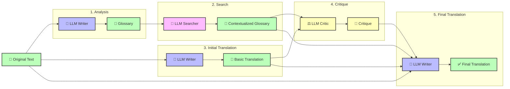

# 🌐💬 Aphra

```mermaid
flowchart LR
    T[📄 Original Text]
    
    subgraph "1. Analysis"
        direction TB
        A[🤖 LLM Writer] -->C[📄 Glossary]
    end
    
    subgraph "2. Search"
        direction TB
        D[🔎 LLM Searcher] --> F[📄 Contextualized Glossary]
    end
    
    subgraph "3. Initial Translation"
        direction TB
        G[🤖 LLM Writer] -->H[📝 Basic Translation]
    end
    
    subgraph "4. Critique"
        direction TB
        I[⚖️ LLM Critic] --> J[💬 Critique]
    end
    
    subgraph "5. Final Translation"
        direction TB
        K[🤖 LLM Writer] --> L[✅ Final Translation]
    end

    T --> A
    T --> G
    C --> D
    F --> I
    H --> I
    T --> K
    H --> K
    F --> K
    J --> K
    
    classDef default fill:#abb,stroke:#333,stroke-width:2px;
    classDef robot fill:#bbf,stroke:#333,stroke-width:2px;
    classDef document fill:#bfb,stroke:#333,stroke-width:2px;
    classDef search fill:#fbf,stroke:#333,stroke-width:2px;
    classDef critic fill:#ffb,stroke:#333,stroke-width:2px;
    class A,G,K robot;
    class T,B,C,F,H,L document;
    class D search;
    class I,J critic;
```
